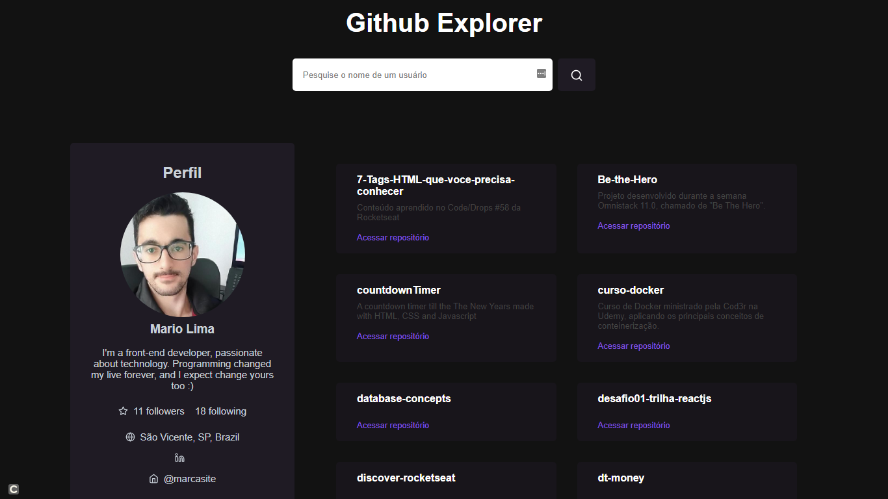

<!-- ************************************* Baadges ********************************************* -->
<p align="center">
  

 

  <a href="https://github.com/tgmarinho/nlw1/commits/master">
    
  </a>
</p>

<!-- ************************************* Título ********************************************* -->

<h1> :computer: Github Explorer</h1>

<!-- ************************************* Sobre o projeto ********************************************* -->

<h2>:revolving_hearts: Sobre o Projeto</h2>

<p>Projeto desenvolvido durante o Chapter I do Ignite da Rockseat, explorando os principais conceitos da biblioteca de construção de interfaces React.js, na qual aprendemos a utilizar e separar a aplicação em componentes, em passar propriedades de pai para filho e manipular o estado das informações, criando e configurando o projeto do zero com Babel, Webpack e Typescript</p>

---

<h3>📚 Linguagens / Frameworks / Bibliotecas</h3>

* ReactJS
* SASS
* JavaScript
* Babel
* Webpack
* Typescript

<h2>🖼️ Imagens do Projeto</h2>

<div align="center" >
  
</div>

</br>

<h3> 🎲 Rodando o Projeto</h3>

```bash
# Clone este repositório
$ git clone https://github.com/limaCoder/github-explorer.git

# Acesse a pasta do projeto
$ cd github-explorer

# execute o projeto
$ yarn dev
```

---
⌨️ com ❤️ por [Mario Lima](https://gist.github.com/limaCoder) 😊
